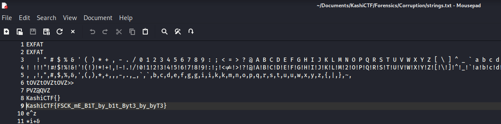

## Description of the challenge

A corrupt drive I see...

## Solution

We get an ISO file. To find the flag, I used the command ```strings <ISO file name> > strings.txt``` and then search for the flag.

