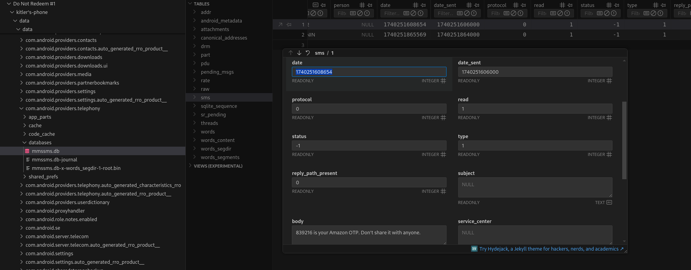

## Description of the challenge

Uh oh, we're in trouble again. Kitler's Amazon Pay wallet got emptied by some scammer. Can you figure out the OTP sent to kitler right before that happened, as well as the time (unix timestamp in milliseconds) at which kitler received that OTP?

Flag format: KashiCTF{OTP_TIMESTAMP}, i.e. KashiCTF{XXXXXX_XXXXXXXXXXXXX}

## Solution
To find the OPT and timestamp, we have to navigate to *data/data/com.android.providers.telephony/databases* and then open the database named mmssms.db. This application uses SQL lite 3. 

