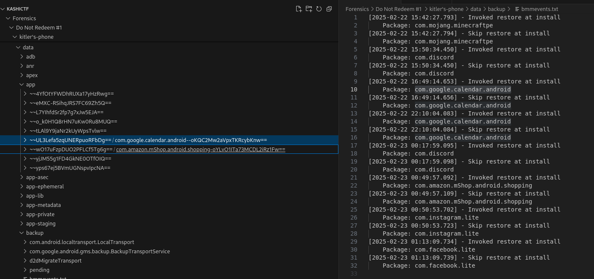

## Description of the challenge

Kitler says he didn't request that OTP, neither did he read or share it. So it must be the scammer at play. Can you figure out the package name of the application that the suspected scammer used to infiltrate Kitler? Wrap your answer within KashiCTF{ and }.

Flag format: KashiCTF{com.example.pacage.name}

## Solution

There is a package with a suspicious name. We can guess that it's an installed app and it's not coming from legitimate package.  

*bmmevents.txt* also helped to find the suspicious package.

**Name of the suspicious package:** com.google.calendar.android 

