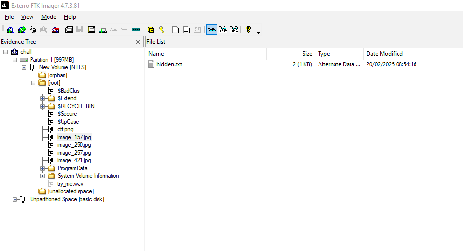
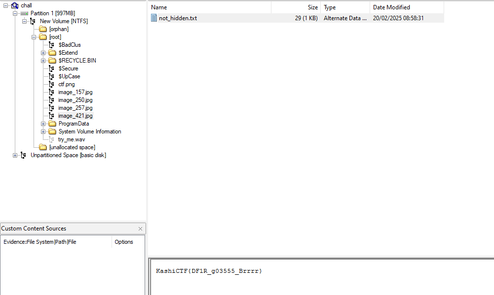

## Description of the challenge

A collection of images, a digital time capsule—preserved in this file. But is every picture really just a picture? A photographer once said, “Every image tells a story, but some stories are meant to stay hidden.” Maybe it’s time to inspect the unseen and find what’s been left behind.

## Solution

“Every image tells a story, but some stories are meant to stay hidden.” is saying that the flag is hidden in one of the image, especially behind the image. 

The file *chall* is a DOS/MBR boot sector MS-MBR Windows 7 english.

I used FTK imager and found out that 4 images are hidding behind them.
For more details look into **Alternate Data Streams (ADS)**

Only one of them contain the flag.

