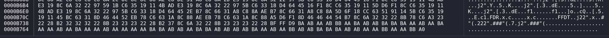
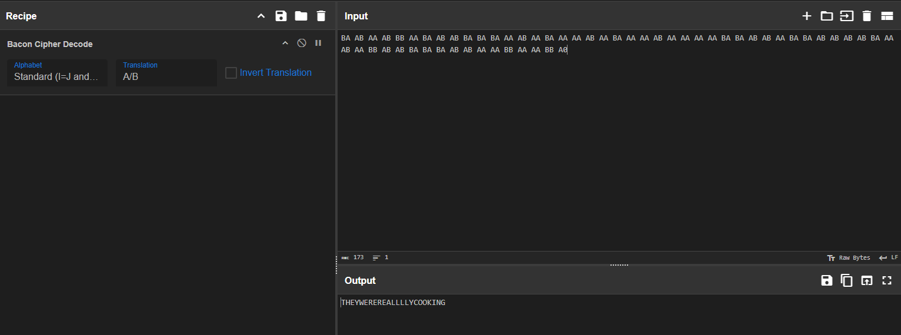

## Description of the challenge

I just asked for my favourite pasta and they gave me this. Are these guys STUPID? Maybe in the end they may give me something real. (Wrap the text in KashiCTF{})


## Solution

I used *ghex* to inspect the JPG file and found out that there are extra data at the end. JPG file should end with **FF D9**.

**Extra data**: ```BA AB AA AB BB AA BA AB AB BA BA BA AA AB AA BA AA AA AB AA BA AA AA AB AA AA AA AA BA BA AB AB AA BA BA AB AB AB AB BA AA AB AA BB AB AB BA BA BA AB AB AA AA BB AA AA BB A0```



Then we have to decode this data using **bacon cipher decode**. We can use Cyberchef. 


