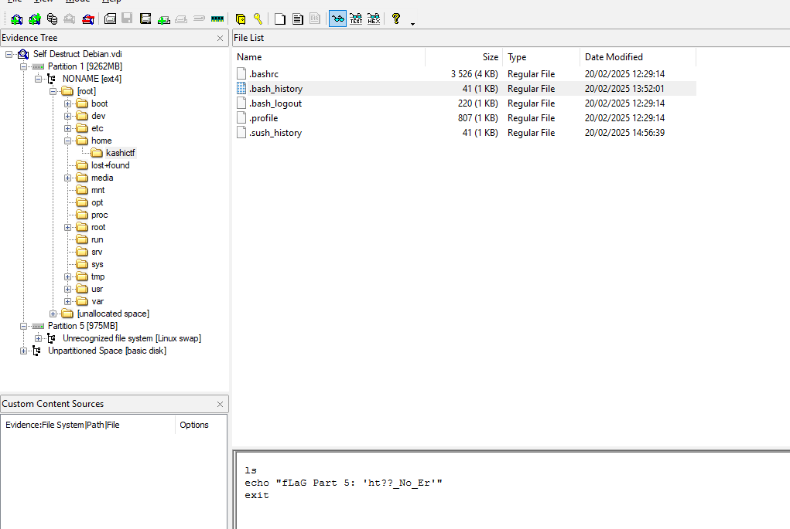
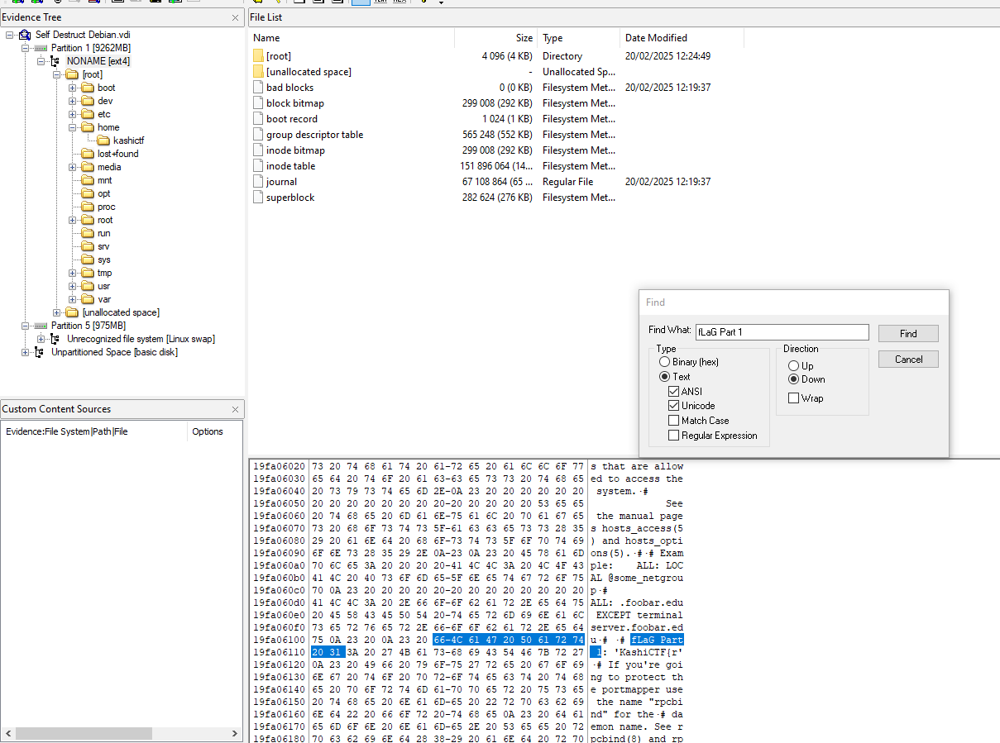

## Description of the challenge

Explore the virtual machine and you might just find the flag. Or a surprise. Maybe....

NOTE: The attachment is a VirtualBox image. Do not run it outside VirtualBox. It is recommended to backup the .vdi file before launching the VM.

VM Parameters: (VirtualBox)
Type: Linux
Version: Debian (32 bits)
RAM: 1024MB
Storage: attached .vdi file

Username: kashictf
Password: kashictf

## Solution

Open FTK imager, go to file > add evidence item > Image File > "select the .vdi file"  

As the description is saying, I explored the .vdi file. And found out that the flag is in parts.

Once I found that. I perform a Search with "FlaG part" as key word. For example, "FlaG part 1:". 
PS: Remember to do it in the folder [root]. Otherwise it'll take too long for searching.

